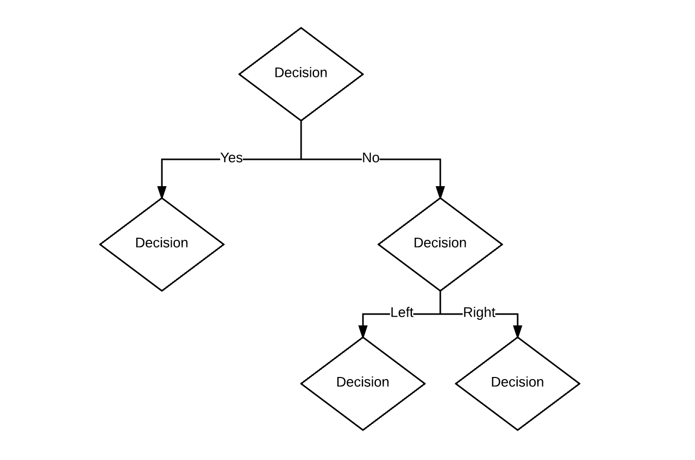

#Narrative

## Why stories?
In the talk, [The storytelling animal: Jonathan Gottschall at TEDxFurmanU](https://www.youtube.com/watch?v=Vhd0XdedLpY), Jonathan Gottshcall tells about the pervasive role stories play in the human experience. Storytelling is how humans organize reality. As a designer, you are organizing reality for the people around you.

## Story and Design

>Design adds story to everyday life...
>
>*– Ellen Lupton, Design Fictions, https://vimeo.com/90492776*

### Contexts of story

**Design thinking** sessions are team-based work sessions where problems are identified and quick prototypes are generated. Story can help team members empathize with the audience to create a better product or service and recognize new ways of approaching solutions.

**Films, novels, drawings and paintings, comic books, and games** are products that tell a story to highlight a moral or ethical quandary, contribute to discourse on a popular or marginalized subject, function a teaching tool, entertain, illuminate, or . 

** Podcasts** often combine journalism techniques and creative sound editing to disseminate knowledge and promote empathy.

https://vimeo.com/150176538 [poor sound quality]

**Industrial design** use visual and sculptural elements to communicate what a product does and how it's used.

**Architecture** uses form and dimension of space and structure to tell the story of how people should use space, creating places for rest or work and all other aspects of sheltered human interaction.

**Wayfinding** is tells the story of how to find your way in an unfamiliar place, often delivered through signs, markers, lights, color, and other architectural features.

**Graphic design** uses visual design elements to communicate simple ideas like how to use a voting ballot to abstract ideas like a company's identity.

**Politicians** use stories to gain public support for proposed policies.

## Narrative structure
A narrative structure orders or disorders the content of a story for the audience. There are commonly used frameworks for storytelling which started with Aristotle's three part structure which consisted of a beginning, middle, and end.

Hollywood films tend to have structures that traditionally sell well in the box office, increasing the probability that they will see a return on the production investment. The perception is that experimental or uncommon narrative structures tend to be risky. The same can be said for large game developers who are prone to sequels of high selling titles.

This can explain why many of the novel or boundary-pushing films tend to come from independent authors and screenwriters, indie game developers, indie filmmakers, and so on.

## Plot

Beats or events in a story where decisions are made. This is different from story structure.

## Freytag's Analysis

Gustav Freytag (1816 - 1895), a German dramatist and novelist, developed the structure for the way stories are told in ancient Greek and Shakespearean drama. This analysis is known as Freytag's analysis, dramatic structure, or Freytag's Pyramid. His analysis consisted of the following parts:

1. exposition
2. rising action
3. climax
4. falling action
5. dénouement/resolution

This structure was more descriptive of Greek and Shakespearean plays, whereas contemporary narrative structures have much greater contrast in rising and falling action.
## Types of Structures
### Linear Narrative
Almost all Hollywood films, Shakespearean plays, and Greek and Roman Mythologies fall into this category.

- Three Act Structure
- Five Act Structure
- Journey

### Three Act Plot Diagram

### Non-linear Narrative:
A non-linear structure is not necessarily chronological or cause and effect based. Story is unfolded simultaneously and recursively.

### Interactive Narrative
The storyline in an interactive narrative work is not predetermined. The story is constructed based on a viewer's choices real-time. Games that use this structure often rely on sophisticated AI software to construct the environment around these choices.

#### Decision Nodes
An interactive narrative is comprised of decision or action points called nodes, where the user impacts the unfolding of the narrative by making a choice or performing an action. The choice the user makes can determine which branching narrative path is taken.

For example, let's say you are playing a hypertext narrative, and your character is a young man who sees a hooded figure shoplifting. The options to proceed include a) tell the shopkeeper, b) follow the shoplifter, or c) do nothing. Depending on your choices, the story may unfold in three completely different ways.

#### IF/THEN

Logic...

#### Critical Story Path 

A critical story path can be thought of as the shortest path possible through a series of decision nodes to complete the interactive story. To develop the critical path, you must ensure that all the critical beats, or 

## Bookshelf
[Digital Storytelling: A Creator's Guide to Interactive Entertainment. Carolyn Handler Miller. 2014. ISBN-10: 0415836948](http://www.amazon.com/Digital-Storytelling-creators-interactive-entertainment/dp/0415836948)

[A History of Story-telling]( https://openlibrary.org/books/OL7024013M/A_history_of_story-telling)

## Citations
- http://www.storyboardthat.com/articles/education/english/narrative-structures
- https://www.smashingmagazine.com/2010/01/better-user-experience-using-storytelling-part-one/
- http://www.kickerstudio.com/2008/12/the-disciplines-of-user-experience/
- https://www.smashingmagazine.com/2010/02/better-user-experience-through-storytelling-part-2/