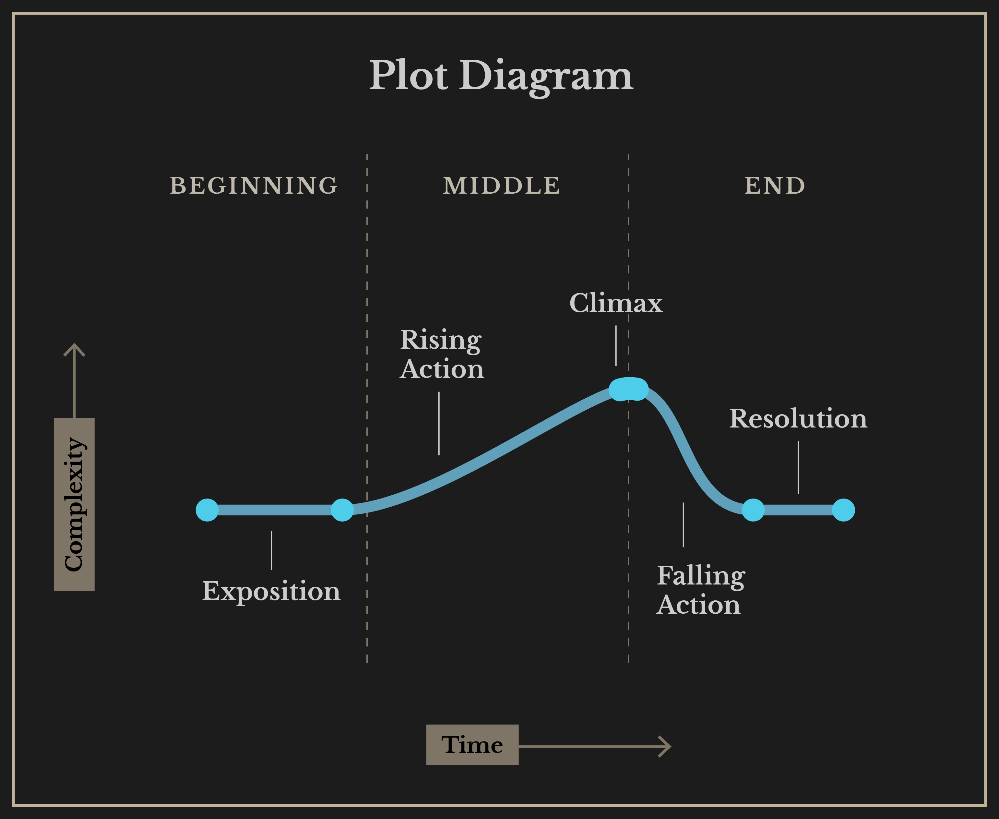

# Narrative structure
A narrative structure orders or disorders the content of a story for the audience. There are commonly used frameworks for storytelling which started with Aristotle's three part structure which consisted of a beginning, middle, and end.

Hollywood films tend to have structures that traditionally sell well in the box office, increasing the probability that they will see a return on the production investment. The perception is that experimental or less used narrative structures tend to be risky. The same can be said for large game developers who are prone to sequels of high selling titles.

This can explain why many of the boundary-pushing films tend to come from independent authors and screenwriters, indie game developers, indie filmmakers, and so on.

Major considerations for the storytelling include:

1. Narrative structure
  - How is the story revealed? 
2. Content
  - What is the story about
3. Delivery Media
  -  How will you tell your story so that people can understand and experience it?

### Freytag's Analysis

Gustav Freytag (1816 - 1895), a German dramatist and novelist, developed the structure for the way stories are told in ancient Greek and Shakespearean drama. This analysis is known as Freytag's analysis, dramatic structure, or Freytag's Pyramid. His analysis consisted of dividing a play into the following parts:

1. exposition
2. rising action
3. climax
4. falling action
5. dénouement/resolution

### Aristotle

Aristotle's framework is comprised of 7 parts 

1. Plot
2. Character
3. Theme
4. Diction
5. Melody
6. Decor
7. Spectacle

### Linear Narrative:
Almost all Hollywood films, Shakespearean plays, and Greek and Roman Mythologies fall into this category.

- Three Act Structure
- Five Act Structure
- Journey

#### Three Act Plot Diagram

### Non-linear Narrative:
Not necessarily chronological or cause and effect based.

### Interactive Narration:

### Interactive Narrative: (check source)
Infinite possibilities based on viewer's choices and preferences.

Example: [No Mans's Sky](http://www.no-mans-sky.com/about/)
